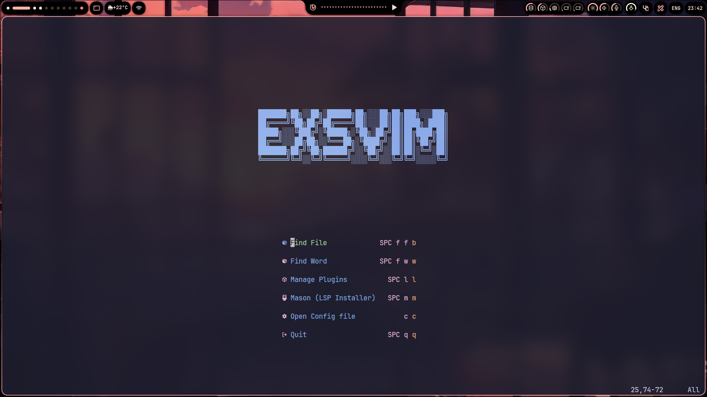

  

# KEYBINDINGS

⚠️ **Warning:** All keybindings are **case-sensitive**!  
`K` is not the same as `k`, and `Shift + Tab` is not the same as `Tab`.  
Make sure you're using the correct key combinations.

## NORMAL MODE

| Key                            | Action                                           |
|--------------------------------|--------------------------------------------------|
| `Ctrl + h`                     | Move cursor to the left window                   |
| `Ctrl + l`                     | Move cursor to the right window                  |
| `Ctrl + k`                     | Move cursor up window                            |
| `Ctrl + j`                     | Move cursor down window                          |
| `Alt + k`                      | Move line up                                     |
| `Alt + j`                      | Move line down                                   |
| `Space + w`                    | Save file                                        |
| `Space + q`                    | Quit from vim or window                          |
| `Tab`                          | Select next bufferline                           |
| `Shift + Tab`                  | Select prev bufferline                           |
| `Ctrl + x`                     | Close buffer                                     |
| `Space + /`                    | Toggle comment                                   |
| `Space + e`                    | Open file explorer                               |
| `Space + f + f`                | Open Telescope Find Files                        |
| `Space + f + b`                | Open Telescope Buffers                           |
| `Space + f + g`                | Open Telescope Live grep                         |

### LSP

| Key                            | Action                                           |
|--------------------------------|--------------------------------------------------|
| `Shift + k` or `K`             | Show documentation                               |
| `g + d`                        | Go to definition                                 |
| `g + D`                        | Go to declaration                                |
| `g + i`                        | Go to implementation                             |
| `g + r`                        | Go to references                                 |
| `Space + l + f`                | Format code                                      |

## VISUAL MODE
| Key                            | Action                                           |
|--------------------------------|--------------------------------------------------|
| `Shift + ,` or `<`             | Move line(s) to the left                         |
| `Shift + .` or `>`             | Move line(s) to the right                        |
| `Alt + k`                      | Move line(s) up                                  |
| `Alt + j`                      | Move line(s) down                                |
| `Space + /`                    | Toggle comment                                   |

## INSERT MODE
| Key                            | Action                                           |
|--------------------------------|--------------------------------------------------|
| `Ctrl + j`                     | Select next line                                 |
| `Ctrl + k`                     | Select prev line                                 |

### AI
| Key                            | Action                                           |
|--------------------------------|--------------------------------------------------|
| `Ctrl + l`                     | Complete line                                    |
